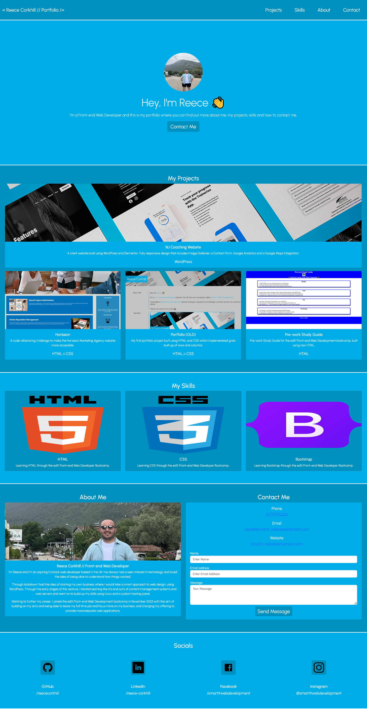

# Reece Corkhill's Bootstrap Portfolio
The official portfolio of Reece Corkhill, made with Bootstrap.

## Description

Being a web developer, it's important to be able to showcase your skills. That's why I've developed my portfolio using Bootstrap.

The aim of this project was to create a new version of my existing portfolio, using Bootstrap to give it a better structure and reduce the amount of styling required to acheive the same functionality. The motivation for doing so was so I could showcase my existing work, but with a new design and modernised feel.

The problem was that, in my previous portfolio which was developed using HTML and CSS only, everything had to be built manually from scratch meaning it took a long time to build what, in today's world would be considered a basic website. The solution to this problem was to re-develop my portfolio and keep the functionality the same, but instead using Bootstrap because this uses pre-built components which massively help to reduce the time it takes to build a site and the overall amount of code needed to achieve the end result.

## Table of Contents

- [Description](#description)
- [Installation](#installation)
- [Credits](#credits)
- [License](#license)

## Installation

N/A

## Usage

My official portfolio website can be viewed <a href="https://reececorkhill.github.io/Bootstrap-Portfolio/"> here</a>.

## Credits

Portfolio project was developed by <a href="https://github.com/reececorkhill">reececorkhill</a>.

## License

MIT License

Copyright (c) 2023 reececorkhill

Permission is hereby granted, free of charge, to any person obtaining a copy
of this software and associated documentation files (the "Software"), to deal
in the Software without restriction, including without limitation the rights
to use, copy, modify, merge, publish, distribute, sublicense, and/or sell
copies of the Software, and to permit persons to whom the Software is
furnished to do so, subject to the following conditions:

The above copyright notice and this permission notice shall be included in all
copies or substantial portions of the Software.

THE SOFTWARE IS PROVIDED "AS IS", WITHOUT WARRANTY OF ANY KIND, EXPRESS OR
IMPLIED, INCLUDING BUT NOT LIMITED TO THE WARRANTIES OF MERCHANTABILITY,
FITNESS FOR A PARTICULAR PURPOSE AND NONINFRINGEMENT. IN NO EVENT SHALL THE
AUTHORS OR COPYRIGHT HOLDERS BE LIABLE FOR ANY CLAIM, DAMAGES OR OTHER
LIABILITY, WHETHER IN AN ACTION OF CONTRACT, TORT OR OTHERWISE, ARISING FROM,
OUT OF OR IN CONNECTION WITH THE SOFTWARE OR THE USE OR OTHER DEALINGS IN THE
SOFTWARE.
